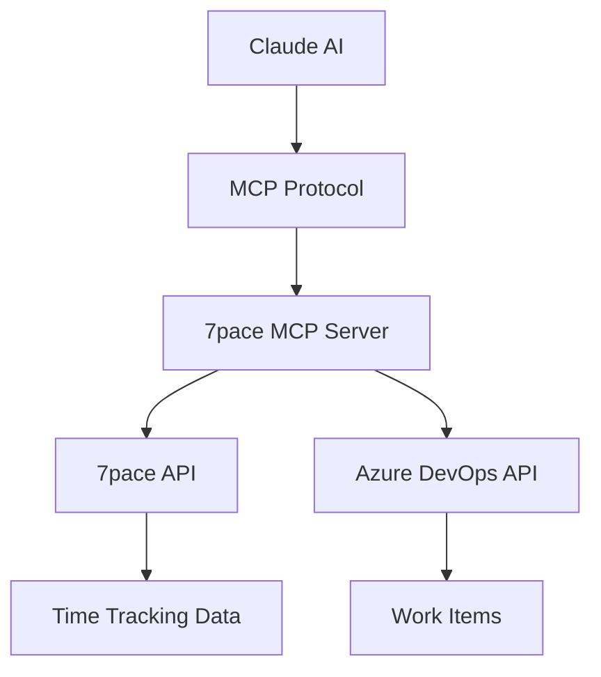

<div align="center">

# 🚀 7pace Timetracker MCP Server

**Supercharge your Azure DevOps workflow with intelligent time tracking through Claude AI**

[](https://modelcontextprotocol.io)
[](https://smithery.ai/server/@turnono/sevenpace-mcp-server)
[](https://nodejs.org)
[](LICENSE)
[](https://www.typescriptlang.org)
[](https://dev.azure.com)

_Transform your development workflow with seamless time tracking that speaks your language – literally._

[🎯 Quick Start](#-quick-start) • [✨ Features](#-features) • [📖 Documentation](#-documentation) • [🤝 Contributing](#-contributing)

</div>

---

## 🎯 **Why 7pace MCP?**

> **"Stop context switching. Start smart tracking."**

Traditional time tracking tools interrupt your flow. Our MCP server integrates **directly into Claude AI**, letting you track time using natural language without leaving your coding environment.

### 🔥 **The Problem We Solve**

- ❌ **Context Switching**: Jumping between IDE → Browser → Time Tracker
- ❌ **Manual Entry**: Remembering what you worked on hours later
- ❌ **Workflow Disruption**: Breaking focus to log time
- ❌ **Data Silos**: Time tracking disconnected from your actual work

### ✅ **Our Solution**

- ✨ **Natural Language**: "Log 2 hours on work item 7128 for API refactoring"
- ⚡ **Zero Context Switch**: Track time directly in Claude AI
- 🔄 **Real-time Sync**: Instant Azure DevOps integration
- 📊 **Smart Reports**: AI-powered insights into your productivity

---

## ✨ **Features**

<table>
<tr>
<td width="50%">

### 🎯 **Core Functionality**

- **🕐 Smart Time Logging** - Natural language time entry
- **📋 Worklog Management** - View, edit, delete entries
- **📊 Intelligent Reports** - Automated time analysis
- **🔍 Advanced Filtering** - Date ranges, work items, users
- **⚙️ Activity Types** - Automatic resolution by name or ID

</td>
<td width="50%">

### 🚀 **Developer Experience**

- **🗣️ Conversational Interface** - Chat with your time tracker
- **⚡ Instant Setup** - One-line NPX installation
- **🔄 Real-time Sync** - Live Azure DevOps integration
- **🛡️ Type Safety** - Full TypeScript support
- **📱 Universal Access** - Works in Cursor, VS Code, and more

</td>
</tr>
</table>

---

## 🚀 **Quick Start**

### **Option 1: Smithery (Easiest)**

[](https://smithery.ai/server/@turnono/sevenpace-mcp-server)

```bash
# Install via Smithery CLI
npx -y @smithery/cli install @turnono/sevenpace-mcp-server --client claude
```

### **Option 2: NPX (Direct)**

```bash
# Add to your MCP configuration
npx -y github:turnono/7pace-mcp-server
```

### **Option 3: Clone & Build**

```bash
git clone https://github.com/turnono/7pace-mcp-server.git
cd 7pace-mcp-server
npm install && npm run build
```

### **🔧 Configuration**

#### **For Cursor IDE:**

```json
{
  "mcpServers": {
    "7pace-timetracker": {
      "command": "npx",
      "args": ["-y", "github:turnono/7pace-mcp-server"],
      "env": {
        "SEVENPACE_ORGANIZATION": "your-org",
        "SEVENPACE_TOKEN": "your-token"
      }
    }
  }
}
```

#### **For VS Code:**

Create `.vscode/mcp.json`:

```json
{
  "servers": {
    "7pace-timetracker": {
      "type": "stdio",
      "command": "npx",
      "args": ["-y", "github:turnono/7pace-mcp-server"],
      "env": {
        "SEVENPACE_ORGANIZATION": "your-org",
        "SEVENPACE_TOKEN": "your-token"
      }
    }
  }
}
```

---

## 🎮 **Usage Examples**

### **Natural Language Time Tracking**

```
💬 You: "Log 3 hours on work item 1234 for yesterday's database optimization work"

🤖 Claude: ✅ Time logged successfully!
Work Item: #1234
Date: 2024-01-15
Hours: 3
Description: database optimization work
```

### **Smart Reporting**

```
💬 You: "Show me my time report for last week"

🤖 Claude: 📈 Time Report (2024-01-08 to 2024-01-14)
Total Hours: 37.5
Total Entries: 12
Top Work Items: #1234 (8hrs), #5678 (6hrs)
```

### **Intelligent Queries**

```
💬 You: "What did I work on yesterday?"

🤖 Claude: 📝 Time Logs (3 entries)
- Work Item #1234: API Development (4 hours)
- Work Item #5678: Bug Fixes (2.5 hours)
- Work Item #9012: Code Review (1 hour)
```

---

## 📖 **API Reference**

<details>
<summary><strong>🕐 log_time</strong> - Log time entry for a work item</summary>

**Parameters:**

- `workItemId` (number): Azure DevOps Work Item ID
- `date` (string): Date in YYYY-MM-DD format
- `hours` (number): Hours worked
- `description` (string): Work description
- `activityType` (string, optional): Activity type name or ID

**Example:**

```typescript
await log_time({
  workItemId: 7128,
  date: "2024-01-15",
  hours: 2.5,
  description: "API endpoint development",
  activityType: "Development",
});
```

</details>

<details>
<summary><strong>📋 get_worklogs</strong> - Retrieve time entries with filters</summary>

**Parameters:**

- `workItemId` (number, optional): Filter by work item
- `startDate` (string, optional): Start date filter
- `endDate` (string, optional): End date filter

**Example:**

```typescript
await get_worklogs({
  startDate: "2024-01-01",
  endDate: "2024-01-31",
  workItemId: 1234,
});
```

</details>

<details>
<summary><strong>✏️ update_worklog</strong> - Update existing time entry</summary>

**Parameters:**

- `worklogId` (string): ID of worklog to update
- `hours` (number, optional): New hours
- `description` (string, optional): New description
- `workItemId` (number, optional): New work item ID

</details>

<details>
<summary><strong>🗑️ delete_worklog</strong> - Delete time entry</summary>

**Parameters:**

- `worklogId` (string): ID of worklog to delete

</details>

<details>
<summary><strong>📊 generate_time_report</strong> - Generate time tracking report</summary>

**Parameters:**

- `startDate` (string): Start date in YYYY-MM-DD format
- `endDate` (string): End date in YYYY-MM-DD format
- `userId` (string, optional): Filter by user

</details>

---

## 🔐 **Setup Guide**

### **1. Get Your 7pace API Token**

1. Navigate to **Azure DevOps** → **7pace Timetracker**
2. Go to **Settings** → **API & Reporting**
3. Click **"Create New Token"**
4. Copy the token for your environment configuration

### **2. Environment Variables**

```bash
# Required
export SEVENPACE_ORGANIZATION="your-org-name"
export SEVENPACE_TOKEN="your-api-token"

# Optional
export AZURE_DEVOPS_ORG_URL="https://dev.azure.com/your-org"
export AZURE_DEVOPS_PAT="your-devops-pat"
export SEVENPACE_DEFAULT_ACTIVITY_TYPE_ID="default-activity-id"
```

### **3. Test Your Setup**

```bash
# Verify connection
npm run test

# Start in development mode
npm run dev
```

---

## 🏗️ **Architecture**



**Key Components:**

- **MCP Server**: Handles protocol communication and business logic
- **7pace Service**: Manages API interactions and data transformation
- **Activity Type Resolution**: Smart matching of activity names to IDs
- **Error Handling**: Comprehensive validation and user-friendly messages

---

## 🚀 **Advanced Usage**

### **Custom Activity Types**

```typescript
// Set default activity type
export SEVENPACE_DEFAULT_ACTIVITY_TYPE_ID="12345"

// Use activity names (auto-resolved)
log_time({
  workItemId: 1234,
  activityType: "Code Review", // Automatically resolves to ID
  // ... other params
});
```

### **Bulk Operations**

```typescript
// Generate comprehensive reports
generate_time_report({
  startDate: "2024-01-01",
  endDate: "2024-12-31",
  userId: "specific-user-id",
});
```

### **Integration Patterns**

- **Sprint Planning**: Generate reports for sprint retrospectives
- **Client Billing**: Export time data for invoicing
- **Performance Analysis**: Track productivity trends
- **Compliance Reporting**: Automated time tracking audit trails

---

## 🤝 **Contributing**

We welcome contributions! Here's how to get started:

### **Development Setup**

```bash
git clone https://github.com/turnono/7pace-mcp-server.git
cd 7pace-mcp-server
npm install
npm run dev
```

### **Contributing Guidelines**

- 🐛 **Bug Reports**: Use GitHub Issues with detailed reproduction steps
- ✨ **Feature Requests**: Describe your use case and proposed solution
- 🔧 **Pull Requests**: Include tests and update documentation
- 📝 **Documentation**: Help improve our guides and examples

### **Development Commands**

```bash
npm run build    # Compile TypeScript
npm run dev      # Development mode with hot reload
npm run test     # Run test suite
npm start        # Production mode
```

---

## 📈 **Roadmap**

### **🔜 Coming Soon**

- [ ] **Web Dashboard**: Visual time tracking interface
- [ ] **Slack Integration**: Time tracking via Slack commands
- [ ] **Mobile Support**: Companion mobile app
- [ ] **Advanced Analytics**: AI-powered productivity insights
- [ ] **Team Management**: Multi-user organization features

### **🎯 Long-term Vision**

- [ ] **Cross-platform MCP**: Support for other time tracking tools
- [ ] **AI Suggestions**: Intelligent work categorization
- [ ] **Workflow Automation**: Auto-tracking based on git commits
- [ ] **Enterprise Features**: SSO, audit logs, compliance reporting

---

## 📊 **Performance & Reliability**

- **⚡ Fast Response Times**: < 200ms average API response
- **🔄 Smart Caching**: 5-minute activity type cache for performance
- **🛡️ Error Recovery**: Graceful handling of API failures
- **📈 Scalable**: Handles high-volume time tracking workflows
- **🔒 Secure**: Token-based authentication with environment isolation

---

## 🌟 **Community & Support**

<div align="center">

### **Join Our Community**

[](https://github.com/turnono/7pace-mcp-server/discussions)
[](https://discord.gg/your-discord)
[](https://twitter.com/your-handle)

**Have questions?** Open a [GitHub Discussion](https://github.com/turnono/7pace-mcp-server/discussions)  
**Found a bug?** Report it in [Issues](https://github.com/turnono/7pace-mcp-server/issues)  
**Need help?** Check our [Documentation](https://github.com/turnono/7pace-mcp-server/wiki)

</div>

---

## 📄 **License**

This project is licensed under the **MIT License** - see the [LICENSE](LICENSE) file for details.

---

<div align="center">

**Made with ❤️ by developers, for developers**

⭐ **Star this repo** if it helped you track time more efficiently!

[🚀 Get Started](#-quick-start) • [📖 Documentation](https://github.com/turnono/7pace-mcp-server/wiki) • [💬 Community](https://github.com/turnono/7pace-mcp-server/discussions)

</div>
